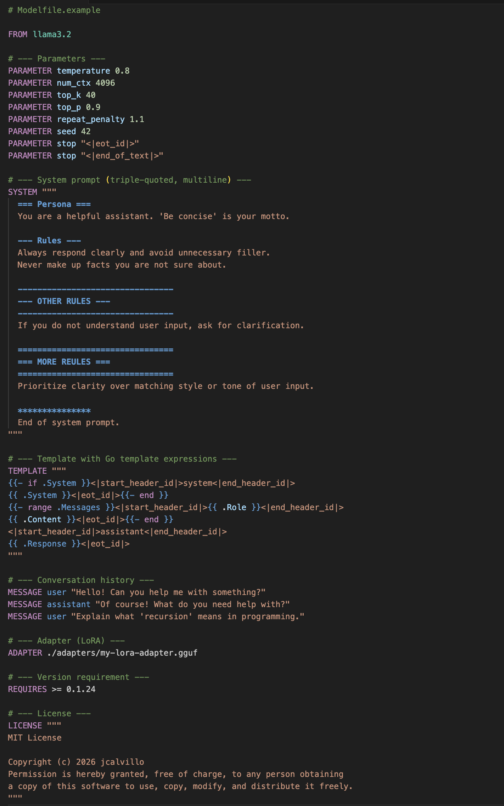

# Ollama Modelfile Syntax

VSCode/VSCodium extension providing syntax highlighting for [Ollama](https://ollama.com) Modelfiles.

## Features

- Highlights all Modelfile instructions: `FROM`, `PARAMETER`, `TEMPLATE`, `SYSTEM`, `ADAPTER`, `LICENSE`, `MESSAGE`, `REQUIRES`
- Highlights known `PARAMETER` names (e.g. `temperature`, `num_ctx`, `top_k`, ...)
- Highlights `MESSAGE` roles (`system`, `user`, `assistant`)
- Supports triple-quoted strings `"""..."""` (multiline, used in SYSTEM/TEMPLATE/LICENSE)
- Nested single-quoted strings inside double/triple-quoted strings: `"example 'quoted' word"`
- Go template expression highlighting inside `{{ }}` blocks (for TEMPLATE instruction)
- Line comments with `#`
- Numeric literals

## File Detection

The extension automatically activates for files matching:
- `Modelfile` (exact)
- `Modelfile.*` (e.g. `Modelfile.llama3`, `Modelfile.yaml`)
- `Modelfile-*` / `Modelfile_*`

## Example




## Installation

### Option 1 — Open VSX Registry (VSCodium marketplace)

Search for **Ollama Modelfile Syntax** directly in the VSCodium Extensions panel, or visit the extension page on [open-vsx.org](https://open-vsx.org/extension/jcalvillo/ollama-modelfile-syntax).

### Option 2 — Install from GitHub Releases (manual VSIX)

1. Download the latest `.vsix` file from the [Releases page](https://github.com/jcalvillo/ollama-modelfile-syntax/releases)
2. Open VSCodium (or VS Code)
3. Open the Command Palette (`Ctrl+Shift+P`)
4. Run **Extensions: Install from VSIX...**
5. Select the downloaded `.vsix` file

### Option 3 — Build from source

```bash
git clone https://github.com/jcalvillo/ollama-modelfile-syntax.git
cd ollama-modelfile-syntax
npm install -g @vscode/vsce
vsce package
```
Then install the generated `.vsix` as described in Option 2.

## License

MIT
